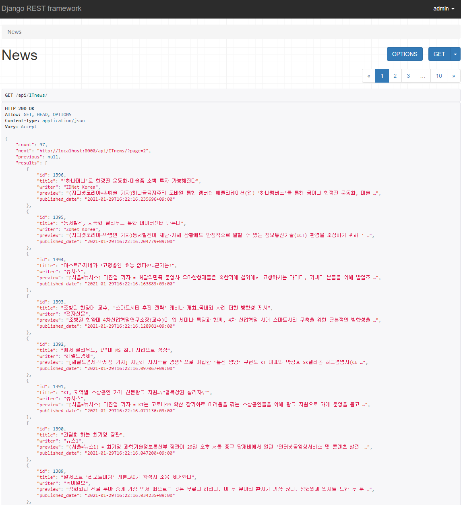

# 💡 IT news crawling site 구축

> crawling IT news site by using Scrapy and Django

<br/><br/>

## 📑 Project description

- IT 뉴스 크롤링 웹사이트 만들기

✅ `Scray`를 이용하여 네이버 IT 뉴스를 크롤링하여 model에 연동된 db에 저장

✅ `django MTV` 패턴을 이용하여 크롤링한 데이터를 보여주는 웹사이트 구축

✅ 최신 데이터 가져오기 `button`을 통한 뉴스 크롤링

✅ 키워드 입력을 통한 `search` 기능 추가

✅ DB에 저장된 데이터를 제공할 수 있는 `RESTful API` 설계


---

<br/><br/>

## 💻 Start Project 

```python
# Scrapy Project
scrapy startproject myscrapy # start scrapy project
scrapy genspider mybot domin # scrapy bot
```

```python
# Django project
django-admin startproject django-scrapy-news # 프로젝트 생성 
python manage.py migrate # db 저장
python manage.py startapp news # 뉴스 app 생성
# 모델 설계 -> 뷰 설계 -> 템플릿 설계
```


---

<br/><br/>

## Project structure


<br/>

django-scrapy-news
        ├─api
        │  ├─migrations
        │  │  └─__pycache__
        │  └─__pycache__
        ├─assets
        ├─myPage
        │  └─__pycache__
        ├─myscraper
        │  ├─.vscode
        │  ├─dbs
        │  └─myscraper
        │      ├─spiders
        │      │  └─__pycache__
        │      └─__pycache__
        ├─news
        │  ├─migrations
        │  │  └─__pycache__
        │  ├─templates
        │  │  └─news
        │  └─__pycache__
        ├─static
        │  ├─css
        │  └─img
        └─templates

---

<br/><br/>

## 👍 Project result

> project demo show

<br/>

#### before crawling


<br/>

#### After crawling


<br/>

#### Search engine


<br/>

#### RESTful API



---

<br/><br/>

## 👨‍👨‍👧‍👦 Members

| name   | 양승현👨🏻‍💻               |
| ------ | ----------------------- |
| period | 2021/01/25 ~ 2021/01/29 |


---


<br/><br/>

## 💻 Development Stack

|    division     |       stack        |
| :-------------: | :----------------: |
|    Framework    |       Django       |
|    Front-end    | Python, html, css  |
|    Back-end     |   Python, Scrapy   |
|       db        |       Sqlite       |
| Code Management |    Git, Github     |
|       IDE       | Visual Studio Code |

